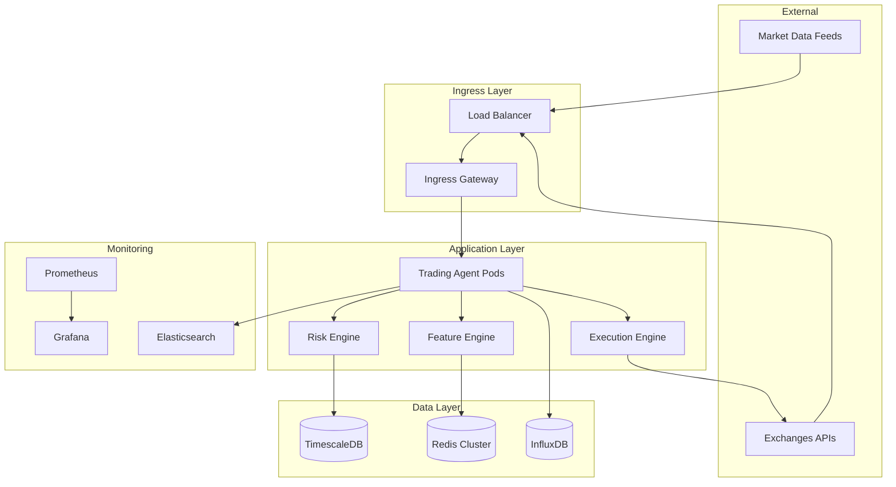

# Déploiement et opérationnalisation de systèmes de trading algorithmique

*Guide production-ready avec templates d'infrastructure pour agents de trading optimisés*

**Vision** : Un système de trading en production doit garantir **99.9% d'uptime**, une latence <100ms end-to-end, une sécurité niveau bancaire et une capacité de scale automatique lors des pics de volatilité. Cette architecture cloud-native utilise Kubernetes, TimescaleDB, Redis cluster et une stack observabilité complète pour assurer ces exigences.

## 1. Architecture d'infrastructure cloud-native

### 1.1 Vue d'ensemble système




### 1.2 Configuration Kubernetes pour trading

```yaml
# trading-namespace.yaml
apiVersion: v1
kind: Namespace
metadata:
  name: trading-production
  labels:
    environment: production
    compliance: financial
---
# trading-agent-deployment.yaml
apiVersion: apps/v1
kind: Deployment
metadata:
  name: trading-agent
  namespace: trading-production
spec:
  replicas: 3
  strategy:
    type: RollingUpdate
    rollingUpdate:
      maxSurge: 1
      maxUnavailable: 0
  selector:
    matchLabels:
      app: trading-agent
  template:
    metadata:
      labels:
        app: trading-agent
        version: v1.2.3
    spec:
      # Contraintes de placement pour latence optimale
      nodeSelector:
        node-type: trading-optimized
      # Affinité anti-pod pour résilience
      affinity:
        podAntiAffinity:
          requiredDuringSchedulingIgnoredDuringExecution:
          - labelSelector:
              matchLabels:
                app: trading-agent
            topologyKey: kubernetes.io/hostname
      
      containers:
      - name: trading-agent
        image: trading-registry/agent:v1.2.3
        imagePullPolicy: IfNotPresent
        
        # Ressources garanties pour performance déterministe
        resources:
          requests:
            memory: "2Gi"
            cpu: "1000m"
          limits:
            memory: "4Gi"
            cpu: "2000m"
            
        # Variables d'environnement sécurisées
        env:
        - name: ENVIRONMENT
          value: "production"
        - name: LOG_LEVEL
          value: "INFO"
        - name: REDIS_HOST
          valueFrom:
            secretKeyRef:
              name: redis-credentials
              key: host
        - name: DB_PASSWORD
          valueFrom:
            secretKeyRef:
              name: db-credentials
              key: password
              
        # Health checks optimisés
        livenessProbe:
          httpGet:
            path: /health/live
            port: 8080
          initialDelaySeconds: 30
          periodSeconds: 10
          timeoutSeconds: 5
          failureThreshold: 3
          
        readinessProbe:
          httpGet:
            path: /health/ready
            port: 8080
          initialDelaySeconds: 10
          periodSeconds: 5
          timeoutSeconds: 3
          
        # Métriques Prometheus
        ports:
        - containerPort: 8080
          name: http
        - containerPort: 9090
          name: metrics
          
        # Volumes pour cache local et logs
        volumeMounts:
        - name: cache-volume
          mountPath: /app/cache
        - name: logs-volume
          mountPath: /app/logs
          
      volumes:
      - name: cache-volume
        emptyDir:
          sizeLimit: 1Gi
      - name: logs-volume
        emptyDir:
          sizeLimit: 500Mi
          
      # Priorité haute pour pods critiques
      priorityClassName: trading-high-priority
---
# HPA pour auto-scaling basé sur latence
apiVersion: autoscaling/v2
kind: HorizontalPodAutoscaler
metadata:
  name: trading-agent-hpa
  namespace: trading-production
spec:
  scaleTargetRef:
    apiVersion: apps/v1
    kind: Deployment
    name: trading-agent
  minReplicas: 3
  maxReplicas: 10
  metrics:
  - type: Resource
    resource:
      name: cpu
      target:
        type: Utilization
        averageUtilization: 70
  - type: Pods
    pods:
      metric:
        name: trading_latency_p99_ms
      target:
        type: AverageValue
        averageValue: "50"  # Scale si latence p99 > 50ms
  behavior:
    scaleUp:
      stabilizationWindowSeconds: 60
      policies:
      - type: Percent
        value: 50
        periodSeconds: 60
    scaleDown:
      stabilizationWindowSeconds: 300
      policies:
      - type: Percent
        value: 10
        periodSeconds: 60
```


## 2. Containerisation Docker optimisée

### 2.1 Dockerfile multi-stage pour trading agent

```dockerfile
# Dockerfile.trading-agent
# Stage 1: Build avec optimisations
FROM python:3.11-slim as builder

# Variables build-time
ARG BUILD_VERSION
ARG GIT_COMMIT
ARG BUILD_DATE

# Installation dépendances système optimisées
RUN apt-get update && apt-get install -y \
    gcc g++ \
    libc6-dev \
    libssl-dev \
    libffi-dev \
    pkg-config \
    && rm -rf /var/lib/apt/lists/*

# Création utilisateur non-root
RUN groupadd -r trading && useradd -r -g trading trading

# Installation Python dependencies
COPY requirements.txt /tmp/
RUN pip install --no-cache-dir --user -r /tmp/requirements.txt

# Pre-compilation Numba/Cython pour startup rapide
COPY src/ /app/src/
WORKDIR /app
RUN python -c "import src.optimized_features; src.optimized_features.precompile_all()"

# Stage 2: Runtime optimisé
FROM python:3.11-slim as runtime

# Copie utilisateur
COPY --from=builder /etc/passwd /etc/passwd
COPY --from=builder /etc/group /etc/group

# Installation runtime dependencies uniquement
RUN apt-get update && apt-get install -y \
    curl \
    && rm -rf /var/lib/apt/lists/*

# Copie dépendances Python
COPY --from=builder /root/.local /home/trading/.local

# Copie application
COPY --from=builder /app /app
WORKDIR /app

# Optimisations système pour trading
RUN echo 'net.core.rmem_max = 16777216' >> /etc/sysctl.conf
RUN echo 'net.core.wmem_max = 16777216' >> /etc/sysctl.conf

# Métadonnées build
LABEL version=$BUILD_VERSION \
      git_commit=$GIT_COMMIT \
      build_date=$BUILD_DATE \
      environment=production

# Configuration utilisateur
USER trading
ENV PATH=/home/trading/.local/bin:$PATH
ENV PYTHONPATH=/app/src
ENV PYTHONUNBUFFERED=1
ENV PYTHONDONTWRITEBYTECODE=1

# Health check intégré
HEALTHCHECK --interval=30s --timeout=5s --start-period=5s --retries=3 \
    CMD curl -f http://localhost:8080/health || exit 1

# Exposition ports
EXPOSE 8080 9090

# Point d'entrée avec signal handling
ENTRYPOINT ["python", "-m", "src.main"]
```


### 2.2 Docker Compose pour développement local

```yaml
# docker-compose.trading.yml
version: '3.8'

services:
  trading-agent:
    build:
      context: .
      dockerfile: Dockerfile.trading-agent
      args:
        BUILD_VERSION: ${GIT_TAG:-dev}
        GIT_COMMIT: ${GIT_COMMIT:-unknown}
        BUILD_DATE: ${BUILD_DATE}
    ports:
      - "8080:8080"
      - "9090:9090"
    environment:
      - ENVIRONMENT=development
      - LOG_LEVEL=DEBUG
      - REDIS_HOST=redis
      - TIMESCALE_HOST=timescaledb
    depends_on:
      - redis
      - timescaledb
      - influxdb
    volumes:
      - ./logs:/app/logs
      - ./cache:/app/cache
    networks:
      - trading-network
    restart: unless-stopped

  redis:
    image: redis:7-alpine
    ports:
      - "6379:6379"
    command: redis-server --appendonly yes --maxmemory 1gb --maxmemory-policy allkeys-lru
    volumes:
      - redis-data:/data
    networks:
      - trading-network

  timescaledb:
    image: timescale/timescaledb:latest-pg15
    ports:
      - "5432:5432"
    environment:
      POSTGRES_DB: trading
      POSTGRES_USER: trading
      POSTGRES_PASSWORD: ${DB_PASSWORD}
    volumes:
      - timescale-data:/var/lib/postgresql/data
      - ./sql/init.sql:/docker-entrypoint-initdb.d/init.sql
    networks:
      - trading-network

  influxdb:
    image: influxdb:2.7-alpine
    ports:
      - "8086:8086"
    environment:
      INFLUXDB_DB: trading_metrics
      INFLUXDB_ADMIN_USER: admin
      INFLUXDB_ADMIN_PASSWORD: ${INFLUX_PASSWORD}
    volumes:
      - influx-data:/var/lib/influxdb2
    networks:
      - trading-network

  prometheus:
    image: prom/prometheus:latest
    ports:
      - "9091:9090"
    volumes:
      - ./monitoring/prometheus.yml:/etc/prometheus/prometheus.yml
      - prometheus-data:/prometheus
    networks:
      - trading-network

  grafana:
    image: grafana/grafana:latest
    ports:
      - "3000:3000"
    environment:
      GF_SECURITY_ADMIN_PASSWORD: ${GRAFANA_PASSWORD}
    volumes:
      - grafana-data:/var/lib/grafana
      - ./monitoring/dashboards:/var/lib/grafana/dashboards
    networks:
      - trading-network

volumes:
  redis-data:
  timescale-data:
  influx-data:
  prometheus-data:
  grafana-data:

networks:
  trading-network:
    driver: bridge
```


## 3. Pipeline CI/CD pour déploiement de modèles

### 3.1 GitLab CI pour trading systems

```yaml
# .gitlab-ci.yml
stages:
  - validate
  - test
  - security
  - build
  - deploy-staging
  - validate-staging
  - deploy-production

variables:
  DOCKER_REGISTRY: registry.trading.internal
  KUBE_NAMESPACE_STAGING: trading-staging
  KUBE_NAMESPACE_PROD: trading-production

# Validation code et modèles
validate:
  stage: validate
  image: python:3.11
  script:
    - pip install -r requirements-dev.txt
    - black --check src/
    - flake8 src/
    - mypy src/
    - pytest tests/unit/ --cov=src --cov-report=xml
    - python scripts/validate_models.py  # Validation modèles ML
  artifacts:
    reports:
      coverage: coverage.xml
    paths:
      - model_validation_report.json
    expire_in: 1 week

# Tests d'intégration avec données de marché
integration_tests:
  stage: test
  image: python:3.11
  services:
    - redis:7
    - timescale/timescaledb:latest-pg15
  variables:
    REDIS_HOST: redis
    TEST_MODE: "true"
  script:
    - pip install -r requirements.txt
    - python -m pytest tests/integration/ -v
    - python scripts/backtest_validation.py  # Backtest sur données historiques
  artifacts:
    paths:
      - backtest_results.json
      - integration_test_report.html
    expire_in: 1 week
  only:
    - merge_requests
    - main

# Scan sécurité
security_scan:
  stage: security
  image: 
    name: owasp/zap2docker-stable
    entrypoint: [""]
  script:
    - pip install safety bandit
    - safety check --json --output safety_report.json
    - bandit -r src/ -f json -o bandit_report.json
    - trivy fs --format json --output trivy_report.json .
  artifacts:
    paths:
      - safety_report.json
      - bandit_report.json
      - trivy_report.json
    expire_in: 1 week

# Build images Docker
build_image:
  stage: build
  image: docker:latest
  services:
    - docker:dind
  variables:
    DOCKER_TLS_CERTDIR: "/certs"
  before_script:
    - docker login -u $CI_REGISTRY_USER -p $CI_REGISTRY_PASSWORD $CI_REGISTRY
  script:
    - |
      docker build \
        --build-arg BUILD_VERSION=$CI_COMMIT_TAG \
        --build-arg GIT_COMMIT=$CI_COMMIT_SHA \
        --build-arg BUILD_DATE=$(date -u +'%Y-%m-%dT%H:%M:%SZ') \
        -t $DOCKER_REGISTRY/trading-agent:$CI_COMMIT_SHA \
        -t $DOCKER_REGISTRY/trading-agent:latest \
        .
    - docker push $DOCKER_REGISTRY/trading-agent:$CI_COMMIT_SHA
    - docker push $DOCKER_REGISTRY/trading-agent:latest
  only:
    - main
    - tags

# Déploiement staging avec blue-green
deploy_staging:
  stage: deploy-staging
  image: bitnami/kubectl:latest
  script:
    - kubectl config use-context staging-cluster
    - |
      # Blue-green deployment
      if kubectl get deployment trading-agent-blue -n $KUBE_NAMESPACE_STAGING; then
        ACTIVE_COLOR=blue
        INACTIVE_COLOR=green
      else
        ACTIVE_COLOR=green
        INACTIVE_COLOR=blue
      fi
    - |
      # Deploy nouvelle version sur couleur inactive
      envsubst < k8s/deployment.yaml | \
      sed "s/trading-agent/trading-agent-$INACTIVE_COLOR/g" | \
      sed "s/image_tag/$CI_COMMIT_SHA/g" | \
      kubectl apply -f - -n $KUBE_NAMESPACE_STAGING
    - |
      # Attendre readiness
      kubectl rollout status deployment/trading-agent-$INACTIVE_COLOR -n $KUBE_NAMESPACE_STAGING
    - |
      # Switch service vers nouvelle version
      kubectl patch service trading-agent-service -n $KUBE_NAMESPACE_STAGING \
        -p '{"spec":{"selector":{"app":"trading-agent-'$INACTIVE_COLOR'"}}}'
    - |
      # Cleanup ancienne version après délai
      sleep 300
      kubectl delete deployment trading-agent-$ACTIVE_COLOR -n $KUBE_NAMESPACE_STAGING
  environment:
    name: staging
    url: https://trading-staging.internal
  only:
    - main

# Validation staging avec tests fonctionnels
validate_staging:
  stage: validate-staging
  image: python:3.11
  script:
    - pip install -r requirements-test.txt
    - python tests/functional/validate_staging.py
    - python tests/performance/latency_test.py --target-latency=100ms
    - python tests/trading/paper_trading_validation.py --duration=1h
  artifacts:
    paths:
      - staging_validation_report.json
    expire_in: 1 week
  when: manual  # Validation manuelle avant production

# Déploiement production avec canary
deploy_production:
  stage: deploy-production
  image: bitnami/kubectl:latest
  script:
    - kubectl config use-context production-cluster
    - |
      # Canary deployment - 10% traffic puis 100%
      envsubst < k8s/deployment.yaml | \
      sed "s/image_tag/$CI_COMMIT_SHA/g" | \
      kubectl apply -f - -n $KUBE_NAMESPACE_PROD
    - |
      # Monitoring canary pendant 10 minutes
      python scripts/canary_monitor.py --duration=600 --error-threshold=0.01
    - |
      # Si succès, déploiement complet
      kubectl scale deployment trading-agent --replicas=3 -n $KUBE_NAMESPACE_PROD
  environment:
    name: production
    url: https://trading.internal
  when: manual
  only:
    - tags
```


### 3.2 Script de monitoring canary

```python
# scripts/canary_monitor.py
import time
import requests
import sys
from datetime import datetime, timedelta

class CanaryMonitor:
    def __init__(self, prometheus_url, error_threshold=0.01):
        self.prometheus_url = prometheus_url
        self.error_threshold = error_threshold
        
    def monitor_deployment(self, duration_seconds):
        """Surveille déploiement canary pendant la durée spécifiée"""
        start_time = datetime.now()
        end_time = start_time + timedelta(seconds=duration_seconds)
        
        print(f"Monitoring canary deployment for {duration_seconds}s...")
        
        while datetime.now() < end_time:
            metrics = self.get_current_metrics()
            
            if self.should_rollback(metrics):
                print("ROLLBACK TRIGGERED - Error rate too high")
                return False
                
            print(f"Metrics OK - Error rate: {metrics['error_rate']:.4f}, "
                  f"Latency p95: {metrics['latency_p95']:.2f}ms")
                  
            time.sleep(30)  # Check every 30s
            
        print("Canary validation successful!")
        return True
    
    def get_current_metrics(self):
        """Récupère métriques actuelles depuis Prometheus"""
        # Error rate query
        error_query = '''
        sum(rate(http_requests_total{status=~"5.."}[5m])) / 
        sum(rate(http_requests_total[5m]))
        '''
        
        # Latency p95 query  
        latency_query = '''
        histogram_quantile(0.95, 
          sum(rate(http_request_duration_seconds_bucket[5m])) by (le)
        ) * 1000
        '''
        
        error_rate = self.query_prometheus(error_query)
        latency_p95 = self.query_prometheus(latency_query)
        
        return {
            'error_rate': error_rate,
            'latency_p95': latency_p95,
            'timestamp': datetime.now()
        }
    
    def should_rollback(self, metrics):
        """Détermine si rollback nécessaire"""
        return (metrics['error_rate'] > self.error_threshold or 
                metrics['latency_p95'] > 200)  # 200ms max latency
    
    def query_prometheus(self, query):
        """Exécute requête Prometheus"""
        response = requests.get(
            f"{self.prometheus_url}/api/v1/query",
            params={'query': query}
        )
        result = response.json()
        
        if result['status'] == 'success' and result['data']['result']:
            return float(result['data']['result'][^0]['value'][^1])
        return 0.0

if __name__ == "__main__":
    import argparse
    parser = argparse.ArgumentParser()
    parser.add_argument('--duration', type=int, default=600)
    parser.add_argument('--error-threshold', type=float, default=0.01)
    
    args = parser.parse_args()
    
    monitor = CanaryMonitor(
        prometheus_url="http://prometheus:9090",
        error_threshold=args.error_threshold
    )
    
    success = monitor.monitor_deployment(args.duration)
    sys.exit(0 if success else 1)
```


## 4. Optimisation base de données pour séries temporelles

### 4.1 Configuration TimescaleDB optimisée

```sql
-- Schema optimisé pour données trading
CREATE EXTENSION IF NOT EXISTS timescaledb;

-- Table principale pour ticks
CREATE TABLE market_data (
    timestamp TIMESTAMPTZ NOT NULL,
    symbol VARCHAR(20) NOT NULL,
    price DECIMAL(20,8) NOT NULL,
    volume DECIMAL(20,8) NOT NULL,
    bid DECIMAL(20,8),
    ask DECIMAL(20,8),
    trade_id BIGINT,
    exchange VARCHAR(20) NOT NULL
);

-- Conversion en hypertable TimescaleDB
SELECT create_hypertable('market_data', 'timestamp', 
    chunk_time_interval => INTERVAL '1 hour',
    if_not_exists => TRUE
);

-- Index optimisés pour requêtes trading
CREATE INDEX CONCURRENTLY idx_market_data_symbol_time 
ON market_data (symbol, timestamp DESC);

CREATE INDEX CONCURRENTLY idx_market_data_exchange_time 
ON market_data (exchange, timestamp DESC) 
WHERE timestamp > NOW() - INTERVAL '24 hours';

-- Partition par symbol pour parallélisation
SELECT add_dimension('market_data', 'symbol', number_partitions => 4);

-- Compression automatique après 24h
ALTER TABLE market_data SET (
    timescaledb.compress,
    timescaledb.compress_segmentby = 'symbol,exchange'
);

SELECT add_compression_policy('market_data', INTERVAL '24 hours');

-- Rétention automatique (garder 1 an)
SELECT add_retention_policy('market_data', INTERVAL '1 year');

-- Continuous aggregates pour OHLCV
CREATE MATERIALIZED VIEW ohlcv_1min WITH (timescaledb.continuous) AS
SELECT 
    time_bucket('1 minute', timestamp) AS bucket,
    symbol,
    exchange,
    first(price, timestamp) AS open,
    max(price) AS high,
    min(price) AS low,  
    last(price, timestamp) AS close,
    sum(volume) AS volume,
    count(*) AS trades
FROM market_data
GROUP BY bucket, symbol, exchange;

-- Politique de rafraîchissement temps réel
SELECT add_continuous_aggregate_policy('ohlcv_1min',
    start_offset => INTERVAL '1 hour',
    end_offset => INTERVAL '1 minute',
    schedule_interval => INTERVAL '1 minute'
);

-- Configuration connexions optimisée
ALTER SYSTEM SET max_connections = 200;
ALTER SYSTEM SET shared_buffers = '1GB';
ALTER SYSTEM SET effective_cache_size = '3GB';
ALTER SYSTEM SET work_mem = '64MB';
ALTER SYSTEM SET maintenance_work_mem = '256MB';
ALTER SYSTEM SET checkpoint_completion_target = 0.9;
ALTER SYSTEM SET wal_buffers = '64MB';
ALTER SYSTEM SET random_page_cost = 1.1;  -- SSD optimized
```


### 4.2 Pool de connexions optimisé

```python
# database/connection_pool.py
import asyncpg
import asyncio
from contextlib import asynccontextmanager

class OptimizedDBPool:
    """Pool de connexions optimisé pour trading haute fréquence"""
    
    def __init__(self, dsn, min_size=10, max_size=50):
        self.dsn = dsn
        self.min_size = min_size
        self.max_size = max_size
        self.pool = None
        
    async def initialize(self):
        """Initialisation pool avec optimisations"""
        self.pool = await asyncpg.create_pool(
            self.dsn,
            min_size=self.min_size,
            max_size=self.max_size,
            max_queries=50000,
            max_inactive_connection_lifetime=300,
            # Optimisations spécifiques
            command_timeout=5,
            server_settings={
                'jit': 'off',  # Disable JIT pour latence prévisible
                'application_name': 'trading_agent',
                'tcp_keepalives_idle': '30',
                'tcp_keepalives_interval': '5',
                'tcp_keepalives_count': '3'
            }
        )
        
    @asynccontextmanager
    async def acquire(self):
        """Context manager pour connexions"""
        async with self.pool.acquire() as conn:
            # Optimisations session
            await conn.execute('SET statement_timeout = 5000')  # 5s timeout
            await conn.execute('SET lock_timeout = 1000')       # 1s lock timeout
            yield conn
    
    async def execute_fast_query(self, query, *args):
        """Exécution requête optimisée pour latence"""
        async with self.acquire() as conn:
            # Préparation statement pour réutilisation
            stmt = await conn.prepare(query)
            return await stmt.fetch(*args)
    
    async def bulk_insert_ticks(self, ticks_data):
        """Insertion bulk optimisée pour ticks"""
        async with self.acquire() as conn:
            await conn.copy_records_to_table(
                'market_data',
                records=ticks_data,
                columns=['timestamp', 'symbol', 'price', 'volume', 'exchange']
            )
```


## 5. Stratégies de cache Redis pour données de marché

### 5.1 Configuration Redis Cluster

```yaml
# redis-cluster-config.yaml
apiVersion: v1
kind: ConfigMap
metadata:
  name: redis-cluster-config
data:
  redis.conf: |
    # Configuration optimisée pour trading
    maxmemory 4gb
    maxmemory-policy allkeys-lru
    
    # Persistance optimisée pour performance
    save 900 1
    save 300 10
    save 60 10000
    
    # Network optimizations
    tcp-keepalive 300
    tcp-backlog 511
    timeout 0
    
    # Memory optimizations
    hash-max-ziplist-entries 512
    hash-max-ziplist-value 64
    list-max-ziplist-size -2
    set-max-intset-entries 512
    
    # Disable expensive operations
    slowlog-log-slower-than 10000
    slowlog-max-len 128
    
    # Cluster specific
    cluster-enabled yes
    cluster-config-file nodes.conf
    cluster-node-timeout 5000
    cluster-announce-ip ${POD_IP}
    cluster-announce-port 6379
    cluster-announce-bus-port 16379
---
apiVersion: apps/v1
kind: StatefulSet
metadata:
  name: redis-cluster
spec:
  serviceName: redis-cluster
  replicas: 6  # 3 masters + 3 replicas
  selector:
    matchLabels:
      app: redis-cluster
  template:
    metadata:
      labels:
        app: redis-cluster
    spec:
      containers:
      - name: redis
        image: redis:7-alpine
        ports:
        - containerPort: 6379
          name: redis
        - containerPort: 16379
          name: bus
        env:
        - name: POD_IP
          valueFrom:
            fieldRef:
              fieldPath: status.podIP
        volumeMounts:
        - name: redis-data
          mountPath: /data
        - name: redis-config
          mountPath: /usr/local/etc/redis/redis.conf
          subPath: redis.conf
        command:
        - redis-server
        - /usr/local/etc/redis/redis.conf
        resources:
          requests:
            memory: "1Gi"
            cpu: "500m"
          limits:
            memory: "2Gi" 
            cpu: "1"
      volumes:
      - name: redis-config
        configMap:
          name: redis-cluster-config
  volumeClaimTemplates:
  - metadata:
      name: redis-data
    spec:
      accessModes: ["ReadWriteOnce"]
      resources:
        requests:
          storage: 10Gi
```


### 5.2 Cache intelligent pour données de marché

```python
# cache/market_data_cache.py
import redis.asyncio as aioredis
import json
import msgpack
import zlib
from typing import List, Dict, Optional
from datetime import datetime, timedelta

class IntelligentMarketCache:
    """Cache intelligent pour données de marché avec compression et TTL adaptatif"""
    
    def __init__(self, redis_cluster_nodes):
        self.redis = aioredis.RedisCluster(
            startup_nodes=redis_cluster_nodes,
            decode_responses=False,
            skip_full_coverage_check=True,
            max_connections_per_node=20
        )
        
        # TTL adaptatifs selon type de donnée
        self.ttl_config = {
            'tick': 300,        # 5 minutes pour ticks
            'ohlcv_1m': 3600,   # 1 heure pour OHLCV 1min
            'ohlcv_1h': 86400,  # 24h pour OHLCV 1h
            'features': 1800,   # 30 minutes pour features
            'predictions': 60   # 1 minute pour prédictions
        }
    
    async def cache_tick_data(self, symbol: str, tick_data: Dict):
        """Cache tick avec compression optimisée"""
        key = f"tick:{symbol}:{tick_data['timestamp']}"
        
        # Sérialisation + compression
        serialized = msgpack.packb(tick_data)
        compressed = zlib.compress(serialized, level=1)  # Compression rapide
        
        await self.redis.setex(
            key, 
            self.ttl_config['tick'], 
            compressed
        )
        
        # Ajout à série temporelle ordonnée
        score = tick_data['timestamp']
        await self.redis.zadd(f"ticks:{symbol}", {key: score})
        
        # Nettoyage automatique - garder 1000 derniers ticks
        await self.redis.zremrangebyrank(f"ticks:{symbol}", 0, -1001)
    
    async def get_recent_ticks(self, symbol: str, count: int = 100) -> List[Dict]:
        """Récupération ticks récents avec décompression"""
        # Récupération clés triées par timestamp
        tick_keys = await self.redis.zrevrange(f"ticks:{symbol}", 0, count-1)
        
        if not tick_keys:
            return []
        
        # Récupération bulk des données
        pipeline = self.redis.pipeline()
        for key in tick_keys:
            pipeline.get(key)
        
        compressed_ticks = await pipeline.execute()
        
        # Décompression parallèle
        ticks = []
        for compressed_data in compressed_ticks:
            if compressed_data:
                decompressed = zlib.decompress(compressed_data)
                tick_data = msgpack.unpackb(decompressed)
                ticks.append(tick_data)
        
        return ticks
    
    async def cache_features(self, symbol: str, features: Dict, timestamp: int):
        """Cache features avec invalidation intelligente"""
        key = f"features:{symbol}:{timestamp // 60}"  # Bucket par minute
        
        # Ajout métadonnées
        cache_entry = {
            'features': features,
            'timestamp': timestamp,
            'version': '1.0',
            'symbol': symbol
        }
        
        serialized = msgpack.packb(cache_entry)
        
        await self.redis.setex(
            key,
            self.ttl_config['features'],
            serialized
        )
        
        # Index pour invalidation rapide
        await self.redis.sadd(f"feature_keys:{symbol}", key)
        await self.redis.expire(f"feature_keys:{symbol}", self.ttl_config['features'])
    
    async def invalidate_symbol_cache(self, symbol: str):
        """Invalidation intelligente par symbol"""
        # Récupération toutes les clés du symbol
        feature_keys = await self.redis.smembers(f"feature_keys:{symbol}")
        
        if feature_keys:
            # Suppression bulk
            await self.redis.delete(*feature_keys)
            await self.redis.delete(f"feature_keys:{symbol}")
        
        # Nettoyage series temporelles
        await self.redis.delete(f"ticks:{symbol}")
        await self.redis.delete(f"ohlcv_1m:{symbol}")
    
    async def get_cache_stats(self) -> Dict:
        """Statistiques d'utilisation cache"""
        info = await self.redis.info('memory')
        
        # Calcul hit ratio approximatif
        keyspace_hits = int(info.get('keyspace_hits', 0))
        keyspace_misses = int(info.get('keyspace_misses', 0))
        
        hit_ratio = keyspace_hits / (keyspace_hits + keyspace_misses) if (keyspace_hits + keyspace_misses) > 0 else 0
        
        return {
            'memory_used_mb': int(info.get('used_memory', 0)) / 1024 / 1024,
            'hit_ratio': hit_ratio,
            'total_keys': await self.redis.dbsize(),
            'connected_clients': int(info.get('connected_clients', 0))
        }
```


## 6. Monitoring et observabilité complète

### 6.1 Configuration Prometheus pour trading

```yaml
# monitoring/prometheus.yml
global:
  scrape_interval: 15s
  evaluation_interval: 15s

rule_files:
  - "trading_rules.yml"

alerting:
  alertmanagers:
    - static_configs:
        - targets:
          - alertmanager:9093

scrape_configs:
  # Trading agent metrics
  - job_name: 'trading-agent'
    static_configs:
      - targets: ['trading-agent:9090']
    scrape_interval: 5s  # Haute fréquence pour trading
    metrics_path: /metrics
    
  # Business metrics spécifiques
  - job_name: 'trading-business-metrics'
    static_configs:
      - targets: ['trading-agent:9091']
    scrape_interval: 10s
    metrics_path: /business-metrics
    
  # Infrastructure
  - job_name: 'redis-cluster'
    static_configs:
      - targets: ['redis-cluster:9121']
    
  - job_name: 'timescaledb'
    static_configs:
      - targets: ['postgres-exporter:9187']
    
  # Kubernetes monitoring
  - job_name: 'kubernetes-pods'
    kubernetes_sd_configs:
      - role: pod
    relabel_configs:
      - source_labels: [__meta_kubernetes_pod_annotation_prometheus_io_scrape]
        action: keep
        regex: true
      - source_labels: [__meta_kubernetes_pod_annotation_prometheus_io_path]
        action: replace
        target_label: __metrics_path__
        regex: (.+)
```


### 6.2 Métriques business spécialisées

```python
# monitoring/trading_metrics.py
from prometheus_client import Counter, Histogram, Gauge, Summary
import time
from functools import wraps

# Métriques de performance trading
TRADES_TOTAL = Counter('trading_trades_total', 'Total trades executed', ['symbol', 'side', 'status'])
TRADE_PNL = Histogram('trading_pnl_usd', 'Trade P&L in USD', ['symbol'], buckets=[-1000, -100, -10, 0, 10, 100, 1000, float('inf')])
POSITION_SIZE = Gauge('trading_position_size_usd', 'Current position size', ['symbol'])
DECISION_LATENCY = Histogram('trading_decision_latency_seconds', 'Decision latency', buckets=[0.001, 0.005, 0.01, 0.05, 0.1, 0.5, 1.0])

# Métriques de qualité des données
DATA_QUALITY_SCORE = Gauge('trading_data_quality_score', 'Data quality score (0-1)', ['source'])
MISSING_TICKS = Counter('trading_missing_ticks_total', 'Missing ticks detected', ['symbol', 'exchange'])

# Métriques de modèle ML
MODEL_ACCURACY = Gauge('trading_model_accuracy', 'Model accuracy (rolling)', ['model_name'])
PREDICTION_CONFIDENCE = Histogram('trading_prediction_confidence', 'Prediction confidence', ['model_name'])
FEATURE_DRIFT = Gauge('trading_feature_drift', 'Feature drift score', ['feature_name'])

class TradingMetricsCollector:
    """Collecteur de métriques trading spécialisées"""
    
    def __init__(self):
        self.start_time = time.time()
        
    def record_trade(self, symbol: str, side: str, pnl: float, size: float, status: str = 'executed'):
        """Enregistrement trade avec métriques"""
        TRADES_TOTAL.labels(symbol=symbol, side=side, status=status).inc()
        TRADE_PNL.labels(symbol=symbol).observe(pnl)
        POSITION_SIZE.labels(symbol=symbol).set(size)
    
    def record_decision_latency(self, duration_seconds: float):
        """Enregistrement latence décision"""
        DECISION_LATENCY.observe(duration_seconds)
    
    def record_model_performance(self, model_name: str, accuracy: float, confidence: float):
        """Enregistrement performance modèle"""
        MODEL_ACCURACY.labels(model_name=model_name).set(accuracy)
        PREDICTION_CONFIDENCE.labels(model_name=model_name).observe(confidence)
    
    def record_data_quality(self, source: str, quality_score: float):
        """Enregistrement qualité données"""
        DATA_QUALITY_SCORE.labels(source=source).set(quality_score)

def measure_latency(metric_name):
    """Décorateur pour mesurer latence automatiquement"""
    def decorator(func):
        @wraps(func)
        async def wrapper(*args, **kwargs):
            start_time = time.time()
            try:
                result = await func(*args, **kwargs)
                return result
            finally:
                duration = time.time() - start_time
                if metric_name == 'decision':
                    DECISION_LATENCY.observe(duration)
        return wrapper
    return decorator

# Usage dans le trading agent
metrics = TradingMetricsCollector()

@measure_latency('decision')
async def make_trading_decision(market_data):
    # Logique de décision trading
    pass
```


## 7. Logging structuré et compliance

### 7.1 Configuration logging pour compliance

```python
# logging/compliance_logger.py
import structlog
import json
from datetime import datetime
from typing import Dict, Any
import uuid

# Configuration structlog pour compliance
structlog.configure(
    processors=[
        structlog.stdlib.filter_by_level,
        structlog.stdlib.add_logger_name,
        structlog.stdlib.add_log_level,
        structlog.stdlib.PositionalArgumentsFormatter(),
        structlog.processors.TimeStamper(fmt="iso"),
        structlog.processors.StackInfoRenderer(),
        structlog.processors.format_exc_info,
        structlog.processors.UnicodeDecoder(),
        structlog.processors.JSONRenderer()  # JSON pour parsing automatique
    ],
    context_class=dict,
    logger_factory=structlog.stdlib.LoggerFactory(),
    wrapper_class=structlog.stdlib.BoundLogger,
    cache_logger_on_first_use=True,
)

class ComplianceLogger:
    """Logger spécialisé pour compliance réglementaire"""
    
    def __init__(self, trader_id: str, environment: str):
        self.logger = structlog.get_logger("trading.compliance")
        self.trader_id = trader_id
        self.environment = environment
        self.session_id = str(uuid.uuid4())
    
    def log_trade_decision(self, decision_data: Dict[str, Any]):
        """Log décision de trade pour audit"""
        self.logger.info(
            "trade_decision",
            event_type="TRADE_DECISION",
            trader_id=self.trader_id,
            session_id=self.session_id,
            symbol=decision_data['symbol'],
            side=decision_data['side'],
            quantity=decision_data['quantity'],
            price=decision_data.get('price'),
            reason=decision_data.get('reason', 'algorithm'),
            confidence=decision_data.get('confidence'),
            market_conditions=decision_data.get('market_conditions'),
            timestamp=datetime.utcnow().isoformat(),
            environment=self.environment
        )
    
    def log_trade_execution(self, execution_data: Dict[str, Any]):
        """Log exécution trade"""
        self.logger.info(
            "trade_execution",
            event_type="TRADE_EXECUTION",
            trader_id=self.trader_id,
            session_id=self.session_id,
            trade_id=execution_data['trade_id'],
            symbol=execution_data['symbol'],
            side=execution_data['side'],
            executed_quantity=execution_data['executed_quantity'],
            executed_price=execution_data['executed_price'],
            execution_time=execution_data['execution_time'],
            venue=execution_data['venue'],
            fees=execution_data.get('fees', 0),
            slippage=execution_data.get('slippage'),
            timestamp=datetime.utcnow().isoformat(),
            environment=self.environment
        )
    
    def log_risk_breach(self, risk_data: Dict[str, Any]):
        """Log violation de limite de risque"""
        self.logger.warning(
            "risk_breach",
            event_type="RISK_BREACH",
            trader_id=self.trader_id,
            session_id=self.session_id,
            breach_type=risk_data['breach_type'],
            current_value=risk_data['current_value'],
            limit_value=risk_data['limit_value'],
            symbol=risk_data.get('symbol'),
            action_taken=risk_data['action_taken'],
            timestamp=datetime.utcnow().isoformat(),
            environment=self.environment,
            severity="HIGH"
        )
    
    def log_system_event(self, event_type: str, details: Dict[str, Any]):
        """Log événement système"""
        self.logger.info(
            "system_event",
            event_type=event_type,
            trader_id=self.trader_id,
            session_id=self.session_id,
            details=details,
            timestamp=datetime.utcnow().isoformat(),
            environment=self.environment
        )
```


### 7.2 Pipeline logs avec ELK Stack

```yaml
# logging/filebeat.yml
filebeat.inputs:
- type: log
  enabled: true
  paths:
    - /app/logs/trading-compliance.log
  json.keys_under_root: true
  json.add_error_key: true
  fields:
    log_type: compliance
    environment: ${ENVIRONMENT}
  fields_under_root: true

- type: log
  enabled: true  
  paths:
    - /app/logs/trading-performance.log
  json.keys_under_root: true
  fields:
    log_type: performance
    environment: ${ENVIRONMENT}
  fields_under_root: true

output.elasticsearch:
  hosts: ["elasticsearch:9200"]
  index: "trading-logs-%{+yyyy.MM.dd}"
  template.name: "trading-logs"
  template.pattern: "trading-logs-*"
  template.settings:
    index.number_of_shards: 3
    index.number_of_replicas: 1
    index.refresh_interval: "5s"

processors:
- add_host_metadata:
    when.not.contains.tags: forwarded
- add_docker_metadata: ~
- add_kubernetes_metadata: ~

logging.level: info
logging.to_files: true
logging.files:
  path: /var/log/filebeat
  name: filebeat
  keepfiles: 7
  permissions: 0644
```


## 8. Sécurité pour infrastructure de trading

### 8.1 Gestion des secrets et rotation de clés

```yaml
# security/secret-management.yaml
apiVersion: v1
kind: Secret
metadata:
  name: trading-api-keys
  namespace: trading-production
type: Opaque
data:
  binance-api-key: <base64-encoded>
  binance-secret-key: <base64-encoded>
  coinbase-api-key: <base64-encoded>
  coinbase-secret-key: <base64-encoded>
---
# External Secrets Operator pour rotation automatique
apiVersion: external-secrets.io/v1beta1
kind: ExternalSecret
metadata:
  name: trading-secrets
  namespace: trading-production
spec:
  refreshInterval: 1h  # Rotation horaire
  secretStoreRef:
    name: vault-backend
    kind: SecretStore
  target:
    name: trading-api-keys
    creationPolicy: Owner
  data:
  - secretKey: binance-api-key
    remoteRef:
      key: trading/binance
      property: api_key
  - secretKey: binance-secret-key
    remoteRef:
      key: trading/binance
      property: secret_key
---
# NetworkPolicy pour isolation réseau
apiVersion: networking.k8s.io/v1
kind: NetworkPolicy
metadata:
  name: trading-network-policy
  namespace: trading-production
spec:
  podSelector:
    matchLabels:
      app: trading-agent
  policyTypes:
  - Ingress
  - Egress
  ingress:
  - from:
    - namespaceSelector:
        matchLabels:
          name: monitoring
    - namespaceSelector:
        matchLabels:
          name: trading-production
    ports:
    - protocol: TCP
      port: 8080
    - protocol: TCP
      port: 9090
  egress:
  - to: []  # Allow all outbound (pour APIs exchanges)
    ports:
    - protocol: TCP
      port: 443
    - protocol: TCP
      port: 80
  - to:
    - namespaceSelector:
        matchLabels:
          name: trading-production
    ports:
    - protocol: TCP
      port: 6379  # Redis
    - protocol: TCP
      port: 5432  # PostgreSQL
```


### 8.2 Audit et contrôle d'accès

```python
# security/audit_logger.py
import hashlib
import hmac
from datetime import datetime
from typing import Dict, Any
import json

class SecurityAuditLogger:
    """Logger d'audit de sécurité pour trading"""
    
    def __init__(self, secret_key: str):
        self.secret_key = secret_key.encode()
        
    def log_api_access(self, user_id: str, endpoint: str, method: str, 
                      ip_address: str, success: bool, response_code: int):
        """Log accès API avec signature"""
        
        audit_entry = {
            'timestamp': datetime.utcnow().isoformat(),
            'event_type': 'API_ACCESS',
            'user_id': user_id,
            'endpoint': endpoint,
            'method': method,
            'ip_address': ip_address,
            'success': success,
            'response_code': response_code,
            'session_id': self._get_session_id()
        }
        
        # Signature pour intégrité
        audit_entry['signature'] = self._sign_entry(audit_entry)
        
        # Log sécurisé
        self._write_audit_log(audit_entry)
    
    def log_trade_authorization(self, user_id: str, trade_data: Dict[str, Any], 
                              authorized: bool, authorization_reason: str):
        """Log autorisation de trade"""
        
        audit_entry = {
            'timestamp': datetime.utcnow().isoformat(),
            'event_type': 'TRADE_AUTHORIZATION',
            'user_id': user_id,
            'trade_id': trade_data.get('trade_id'),
            'symbol': trade_data['symbol'],
            'side': trade_data['side'],
            'quantity': trade_data['quantity'],
            'authorized': authorized,
            'reason': authorization_reason,
            'risk_score': trade_data.get('risk_score')
        }
        
        audit_entry['signature'] = self._sign_entry(audit_entry)
        self._write_audit_log(audit_entry)
    
    def _sign_entry(self, entry: Dict[str, Any]) -> str:
        """Signature HMAC pour intégrité"""
        # Retirer signature existante pour calcul
        entry_copy = {k: v for k, v in entry.items() if k != 'signature'}
        
        # Sérialisation déterministe
        message = json.dumps(entry_copy, sort_keys=True).encode()
        
        # Signature HMAC-SHA256
        signature = hmac.new(self.secret_key, message, hashlib.sha256)
        return signature.hexdigest()
    
    def verify_entry_integrity(self, entry: Dict[str, Any]) -> bool:
        """Vérification intégrité d'une entrée d'audit"""
        stored_signature = entry.get('signature')
        if not stored_signature:
            return False
            
        calculated_signature = self._sign_entry(entry)
        return hmac.compare_digest(stored_signature, calculated_signature)
    
    def _write_audit_log(self, entry: Dict[str, Any]):
        """Écriture sécurisée dans log d'audit"""
        # Écriture append-only dans fichier sécurisé
        with open('/var/log/trading/security-audit.log', 'a', encoding='utf-8') as f:
            f.write(json.dumps(entry) + '\n')
            f.flush()  # Force write pour intégrité
```


## 9. Procédures de backup et disaster recovery

### 9.1 Stratégie de sauvegarde multi-niveaux

```bash
#!/bin/bash
# scripts/backup_trading_system.sh

set -euo pipefail

BACKUP_DATE=$(date +%Y%m%d_%H%M%S)
BACKUP_ROOT="/backups/trading"
S3_BUCKET="trading-backups-encrypted"

# Backup bases de données
backup_databases() {
    echo "Starting database backups..."
    
    # TimescaleDB backup avec compression
    pg_dump -h $TIMESCALE_HOST -U $TIMESCALE_USER -d trading \
        --verbose --no-password \
        | gzip > "$BACKUP_ROOT/db/timescale_$BACKUP_DATE.sql.gz"
    
    # Redis backup
    redis-cli -h $REDIS_HOST --rdb "$BACKUP_ROOT/cache/redis_$BACKUP_DATE.rdb"
    
    # InfluxDB backup
    influx backup -host $INFLUX_HOST:8088 "$BACKUP_ROOT/metrics/influx_$BACKUP_DATE"
}

# Backup modèles ML et configuration
backup_models() {
    echo "Backing up ML models and configs..."
    
    # Modèles depuis MLflow
    mkdir -p "$BACKUP_ROOT/models/$BACKUP_DATE"
    mlflow artifacts download -r file://$MLFLOW_TRACKING_URI \
        -d "$BACKUP_ROOT/models/$BACKUP_DATE"
    
    # Configuration Kubernetes
    kubectl get all,secrets,configmaps -n trading-production -o yaml \
        > "$BACKUP_ROOT/k8s/config_$BACKUP_DATE.yaml"
}

# Backup logs de compliance
backup_compliance_logs() {
    echo "Backing up compliance logs..."
    
    # Logs 30 derniers jours
    find /var/log/trading -name "*.log" -mtime -30 \
        -exec tar -czf "$BACKUP_ROOT/logs/compliance_logs_$BACKUP_DATE.tar.gz" {} \;
}

# Chiffrement et upload S3
encrypt_and_upload() {
    echo "Encrypting and uploading to S3..."
    
    # Chiffrement GPG
    tar -czf - "$BACKUP_ROOT" | \
        gpg --symmetric --cipher-algo AES256 --output "/tmp/trading_backup_$BACKUP_DATE.tar.gz.gpg"
    
    # Upload S3 avec chiffrement côté serveur
    aws s3 cp "/tmp/trading_backup_$BACKUP_DATE.tar.gz.gpg" \
        "s3://$S3_BUCKET/daily/$BACKUP_DATE.tar.gz.gpg" \
        --server-side-encryption AES256
    
    # Nettoyage
    rm "/tmp/trading_backup_$BACKUP_DATE.tar.gz.gpg"
}

# Vérification intégrité
verify_backup() {
    echo "Verifying backup integrity..."
    
    # Checksum verification
    find "$BACKUP_ROOT" -type f -exec sha256sum {} \; \
        > "$BACKUP_ROOT/checksums_$BACKUP_DATE.txt"
    
    # Test restore sur petit échantillon
    test_restore_sample
}

# Rétention automatique
cleanup_old_backups() {
    echo "Cleaning up old backups..."
    
    # Local: garder 7 jours
    find "$BACKUP_ROOT" -type f -mtime +7 -delete
    
    # S3: garder 90 jours daily, 12 mois monthly
    aws s3 ls "s3://$S3_BUCKET/daily/" | while read -r line; do
        createDate=$(echo $line | awk '{print $1" "$2}')
        createDateSec=$(date -d "$createDate" +%s)
        olderThan=$(date -d "90 days ago" +%s)
        
        if [[ $createDateSec -lt $olderThan ]]; then
            fileName=$(echo $line | awk '{print $4}')
            aws s3 rm "s3://$S3_BUCKET/daily/$fileName"
        fi
    done
}

# Execution principale
main() {
    mkdir -p "$BACKUP_ROOT"/{db,cache,metrics,models,k8s,logs}
    
    backup_databases
    backup_models  
    backup_compliance_logs
    verify_backup
    encrypt_and_upload
    cleanup_old_backups
    
    echo "Backup completed successfully: $BACKUP_DATE"
}

main "$@"
```


### 9.2 Plan de disaster recovery automatisé

```yaml
# disaster-recovery/restore-playbook.yaml
apiVersion: v1
kind: ConfigMap
metadata:
  name: disaster-recovery-playbook
data:
  restore.sh: |
    #!/bin/bash
    set -euo pipefail
    
    RECOVERY_MODE=$1  # full|partial|rollback
    BACKUP_DATE=${2:-latest}
    
    case $RECOVERY_MODE in
      "full")
        echo "Starting FULL disaster recovery..."
        restore_infrastructure
        restore_databases
        restore_applications
        validate_recovery
        ;;
      "partial")
        echo "Starting PARTIAL recovery..."
        restore_databases
        validate_recovery
        ;;
      "rollback")
        echo "Starting application ROLLBACK..."
        rollback_application $BACKUP_DATE
        ;;
    esac
    
    restore_infrastructure() {
      # Recreation namespace et ressources
      kubectl apply -f /recovery/k8s/namespace.yaml
      kubectl apply -f /recovery/k8s/secrets.yaml
      kubectl apply -f /recovery/k8s/configmaps.yaml
      kubectl apply -f /recovery/k8s/persistentvolumes.yaml
      
      # Attendre readiness des volumes
      kubectl wait --for=condition=Available --timeout=300s \
        pvc/timescale-data pvc/redis-data -n trading-production
    }
    
    restore_databases() {
      echo "Restoring databases..."
      
      # TimescaleDB restore
      kubectl exec -it timescaledb-0 -n trading-production -- \
        psql -U trading -d trading < /recovery/db/timescale_$BACKUP_DATE.sql
      
      # Redis restore
      kubectl cp /recovery/cache/redis_$BACKUP_DATE.rdb \
        trading-production/redis-0:/data/dump.rdb
      kubectl delete pod redis-0 -n trading-production  # Force restart
      
      # InfluxDB restore
      kubectl exec -it influxdb-0 -n trading-production -- \
        influx restore -portable /recovery/metrics/influx_$BACKUP_DATE
    }
    
    validate_recovery() {
      echo "Validating recovery..."
      
      # Health checks
      kubectl wait --for=condition=Ready --timeout=600s \
        pod -l app=trading-agent -n trading-production
      
      # Data integrity checks
      python /recovery/scripts/validate_data_integrity.py
      
      # Performance baseline check
      python /recovery/scripts/performance_test.py --duration=300
      
      echo "Recovery validation completed successfully"
    }
---
# Job de recovery automatique
apiVersion: batch/v1
kind: Job
metadata:
  name: disaster-recovery-job
spec:
  template:
    spec:
      containers:
      - name: recovery
        image: trading-recovery:latest
        command: ["/recovery/restore.sh"]
        args: ["full", "20250818_120000"]
        volumeMounts:
        - name: recovery-data
          mountPath: /recovery
        env:
        - name: KUBECONFIG
          value: /recovery/kubeconfig
      volumes:
      - name: recovery-data
        persistentVolumeClaim:
          claimName: recovery-pvc
      restartPolicy: OnFailure
  backoffLimit: 3
```


## 10. Templates d'infrastructure production-ready

### 10.1 Terraform pour infrastructure cloud

```hcl
# infrastructure/main.tf
terraform {
  required_version = ">= 1.0"
  required_providers {
    aws = {
      source  = "hashicorp/aws"
      version = "~> 5.0"
    }
    kubernetes = {
      source  = "hashicorp/kubernetes"
      version = "~> 2.0"
    }
  }
  
  backend "s3" {
    bucket = "trading-terraform-state"
    key    = "production/terraform.tfstate"
    region = "us-east-1"
    encrypt = true
  }
}

# EKS Cluster optimisé pour trading
module "eks" {
  source = "terraform-aws-modules/eks/aws"
  
  cluster_name    = "trading-production"
  cluster_version = "1.28"
  
  vpc_id     = module.vpc.vpc_id
  subnet_ids = module.vpc.private_subnets
  
  # Node groups spécialisés
  eks_managed_node_groups = {
    trading_optimized = {
      min_size     = 3
      max_size     = 10
      desired_size = 3
      
      instance_types = ["c6i.2xlarge"]  # CPU optimized
      
      labels = {
        node-type = "trading-optimized"
      }
      
      taints = {
        trading = {
          key    = "trading"
          value  = "true"
          effect = "NO_SCHEDULE"
        }
      }
      
      # Optimisations réseau
      enable_bootstrap_user_data = true
      bootstrap_extra_args = "--container-runtime containerd --kubelet-extra-args '--node-labels=node-type=trading-optimized'"
    }
    
    monitoring = {
      min_size     = 2
      max_size     = 4
      desired_size = 2
      
      instance_types = ["m6i.xlarge"]
      
      labels = {
        node-type = "monitoring"
      }
    }
  }
  
  # Add-ons optimisés
  cluster_addons = {
    coredns = {
      most_recent = true
    }
    kube-proxy = {
      most_recent = true
    }
    vpc-cni = {
      most_recent = true
      configuration_values = jsonencode({
        env = {
          ENABLE_PREFIX_DELEGATION = "true"
          WARM_PREFIX_TARGET       = "1"
        }
      })
    }
    aws-ebs-csi-driver = {
      most_recent = true
    }
  }
}

# RDS pour données de marché (backup TimescaleDB)
resource "aws_db_instance" "trading_db_backup" {
  identifier = "trading-backup-db"
  
  engine         = "postgres"
  engine_version = "15.4"
  instance_class = "db.r6g.xlarge"
  
  allocated_storage     = 1000
  max_allocated_storage = 5000
  storage_type         = "gp3"
  storage_encrypted    = true
  
  db_name  = "trading_backup"
  username = "trading"
  password = var.db_password
  
  backup_retention_period = 30
  backup_window          = "03:00-04:00"
  maintenance_window     = "sun:04:00-sun:05:00"
  
  skip_final_snapshot = false
  final_snapshot_identifier = "trading-backup-final-snapshot"
  
  # Monitoring
  monitoring_interval = 60
  monitoring_role_arn = aws_iam_role.rds_monitoring.arn
  
  # Performance Insights
  performance_insights_enabled = true
  performance_insights_retention_period = 7
  
  tags = {
    Environment = "production"
    Application = "trading"
    Purpose     = "backup"
  }
}

# ElastiCache Redis Cluster
resource "aws_elasticache_replication_group" "trading_cache" {
  replication_group_id       = "trading-cache"
  description                = "Redis cluster for trading cache"
  
  port               = 6379
  parameter_group_name = aws_elasticache_parameter_group.trading_redis.name
  node_type          = "cache.r6g.xlarge"
  num_cache_clusters = 3
  
  engine_version = "7.0"
  
  # Sécurité
  at_rest_encryption_enabled = true
  transit_encryption_enabled = true
  auth_token                 = var.redis_auth_token
  
  # Backup
  snapshot_retention_limit = 7
  snapshot_window         = "03:00-05:00"
  
  # Maintenance
  maintenance_window = "sun:05:00-sun:07:00"
  
  subnet_group_name = aws_elasticache_subnet_group.trading.name
  security_group_ids = [aws_security_group.redis.id]
  
  tags = {
    Environment = "production"
    Application = "trading"
  }
}

# Outputs pour intégration
output "cluster_endpoint" {
  value = module.eks.cluster_endpoint
}

output "cluster_security_group_id" {
  value = module.eks.cluster_security_group_id
}

output "redis_endpoint" {
  value = aws_elasticache_replication_group.trading_cache.primary_endpoint_address
}

output "db_endpoint" {
  value = aws_db_instance.trading_db_backup.endpoint
}
```

Cette architecture complète fournit une base production-ready pour déployer et opérationnaliser des systèmes de trading algorithmique avec les plus hauts standards de performance, sécurité et résilience. Les templates peuvent être adaptés selon les besoins spécifiques et les contraintes réglementaires de chaque organisation.

<div style="text-align: center">⁂</div>

[^1]: https://ieeexplore.ieee.org/document/11038776/

