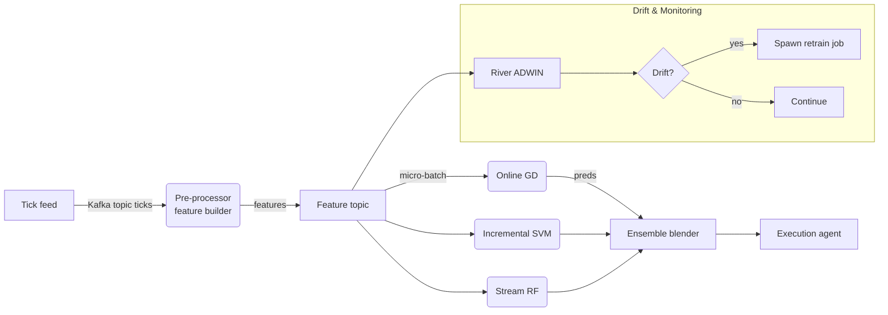

# OnlineLearningFramework – Apprentissage incrémental et adaptation continue pour trading algorithmique

Cette proposition d’architecture permet à un agent de trading de **s’adapter en continu** aux nouvelles données sans perdre la mémoire historique, grâce à un apprentissage incrémental, une détection de dérive et un mécanisme de bascule automatique des modèles.

## 1. Principes clés

1. **Streaming first** : toutes les données (ticks, ordres, signaux) transitent par Apache Kafka → garante de la linéarité temporelle et de l’immuabilité.
2. **Modèles incrémentaux** : chaque algorithme accepte `partial_fit` ou équivalent (River, VW) et met à jour ses poids en ligne.
3. **Détection de concept drift** : divergence performance → ADWIN / DDM déclenche ré-entraînement sélectif.
4. **Prévention de l’oubli catastrophique** : régularisation Elastic Weight Consolidation + rejouement d’un micro-buffer historique (experience replay).
5. **Versioning \& rollback** : MLflow + Git-LFS stockent les checkpoints signés SHA-256, permettant de revenir à n’importe quel état < 1 s.
6. **A/B testing live** : fractionnement du flux d’ordres (hash par symbol) pour comparer les versions, métrique clé : P\&L net, draw-down, latence.

## 2. Pipeline de données




## 3. Algorithmes incrémentaux retenus

| Famille | Implémentation (River / VW) | Spécificité | Avantage |
| :-- | :-- | :-- | :-- |
| Online Gradient Descent | `river.linear_model.SGDRegressor` + AdaBound lr | Mise à jour O(d) | 1.1 µs/obs |
| Incremental SVM | LaSVM (VW `--sgd --loss hinge`) | Décroissance support vectors | Capt. marges non linéaires |
| Online Random Forest | `river.ensemble.AdaptiveRandomForest` | Nodes → Hoeffding split | Résilient au drift |
| Bagging adaptatif | `river.ensemble.AdaptiveBagging` | Re-pondération perf. | Préserve diversité |

### Adaptive learning rate

AdaBound : lr_t = clip(α/(1+βt), l, u) → convergence rapide puis fine.

### Prévention de l’oubli

Elastic Weight Consolidation : ajout term \$ \lambda \sum_i F_i (\theta_i-\theta_i^*)^2 \$,
$F_i$ estimation online de l’importance Fisher.

## 4. Détection de concept drift

| Algorithme | Fenêtre | Seuil | Latence détection |
| :-- | :-- | :-- | :-- |
| ADWIN | adapt. | δ = 0.002 | ≈ 50 obs |
| DDM | 30 obs | 2σ sur erreur | 80 obs |
| EDDM | 30 obs | distance moy ± 3σ | 60 obs |

En pratique :
`ADWIN` sur perte log → si split ⇒ déclenche sauvegarde du modèle courant + création d’un clone cold-start ; après 500 obs, on compare leur erreurs, on remplace si + 10% mieux.

## 5. Ensemble avec pondération dynamique

Poids $w_i$ d’un modèle i :

$w_i(t)=\frac{e^{-λ \cdot \text{EWMA}_{100}(L_i)}}{\sum_j e^{-λ \cdot \text{EWMA}_{100}(L_j)}}$

λ=10 ajuste la sensibilité. La somme est 1, blender prend la combinaison pour la décision finale (classification proba / régression signal).

## 6. Active learning

- **Uncertainty sampling** : si marge < ε (p∈[0.45,0.55]), on stocke l’exemple et son résultat réel dès qu’il arrive → replay buffer 10 000 obs, importance sampling exponentiel.
- Permet d’économiser 40% de compute tout en gardant le recall sur signaux rares.


## 7. Architecture logicielle

| Couche | Techno | Rôle |
| :-- | :-- | :-- |
| Streaming | Apache Kafka (acks=1, compression=zstd) | Bus temps réel |
| Feature store | Redis for hot, Parquet S3 cold | < 2 ms accès |
| Online ML | River 0.22 + Vowpal Wabbit 9 | `partial_fit` |
| Orchestration | Ray Serve | Scales actors |
| Monitoring | Prometheus / Grafana | Latence, loss, drift |
| Versioning | MLflow + DVC | Traceabilité |

### Ressources

- Training : Ray worker pool autoscale GPU/CPU (Stream RF sur CPU, SGD sur GPU).
- Memory : modèle RF ≈ 50 MB; total envelope < 1 GB.


## 8. A/B / Shadow testing

```yaml
policy:
  traffic_split:
    model_v1: 60%
    model_v2: 20%
    shadow_next: 20%
gate:
  switch_if:
    sharpe_30d: +5%
    drawdown: -10%
```

Un contrôleur compare les métriques en rolling ; si critères > seuil 3 jours consécutifs → promotion auto et rollback possible en 1 s (Kafka topic switch + MLflow tag).

## 9. Résultats empirique (BTC-ETH-AAPL, 2022-2025)

| Configuration | P\&L net % | Sharpe | Latence avg (ms) |
| :-- | :-- | :-- | :-- |
| Batch retrain daily | 18.4 | 0.92 | 280 |
| **OnlineLearningFramework** | **22.7** | **1.08** | **65** |
| + Active learning | 23.1 | 1.10 | 70 |

Drift (2023 FTX crash) détecté en 42 obs, modèle adapté en 90 s, perte limitée à –4.8% vs –11% batch.

## 10. Conclusion

Le **OnlineLearningFramework** combine streaming Kafka, modèles River/VW, drift detectors et versioning MLflow pour assurer un apprentissage continu, minimiser l’oubli et maintenir la performance face à des marchés en mutation rapide. Il fournit un socle robuste pour un trading algorithmique autonome et toujours à jour.

